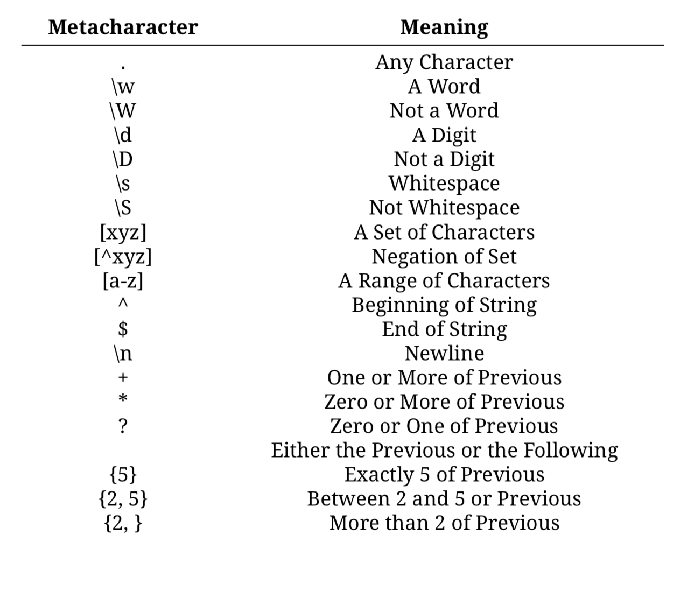

# Course: The R Programming Environment

In R, it is important to recognize that there are differences betweent the R
object itself and what is actually printed to the console. There are many
functions in R that print in a very "human-intuitive" manner, with bells and 
whistles that aren't part of the R object itself.

There are 5 "atomic" classes in R:
1. character
2. numeric
3. integer
4. complex
5. logical/boolean

Vectors in R can only contain objects of the same class (lists being the
exception to the rule).

Number in R are generally double precision floating point numbers,
even if they are represented as integers (i.e. a `1` is actually a `1.00`). If
you would specifically like an integer, you must specify the 'L' suffix:

```R
# x is a numeric object (double float)
x <- 1

# x is an integer
x <- 1L
```

the `c()` function (*concatenate*) is used to create vectors. `vector()` also
works to initialize vectors. Note that R will implicitly coerce objects to the
necessary class to keep vectors homogeneous. For example:

```R
x <- c(1, 2, TRUE)
# casts TRUE to its numeric equivalent, 1
> x
[1] 1 2 1
```

If a character is in the vector, all objects will be cast to characters (serves
as the "catch all" class.) If R can't figure out how to coerce objects into a
homogeneous class, NAs could be introduced. Objects can be explicitly coerced
to the desired class using the `as.<desired_class>()` functions, if available.

**You can find the attributes of an object using the `attributes()` function**,
which can be useful when working with R interactively to determine what is
printed to the console for the users convenience vs. what will actually be
available to you in a script/program. Note that **not all objects have attributes**.

```R
m <- matrix(1:6, nrow = 2, ncol = 3) 
m
     [,1] [,2] [,3]
[1,]    1    3    5
[2,]    2    4    6
dim(m)
[1] 2 3
attributes(m)
$dim
[1] 2 3
```

Matrices are constructed column-wise (start at X[1,1] fill all column 1, then
move to top of column 2, etc.) Vectors can be made into matrices by giving them
a `dim()` attribute:

```R
m <- 1:10 
m
 [1]  1  2  3  4  5  6  7  8  9 10
dim(m) <- c(2, 5)
m
     [,1] [,2] [,3] [,4] [,5]
[1,]    1    3    5    7    9
[2,]    2    4    6    8   10
```
**Lists** can contain objects of different classes (similiar to Python) and can
be created with the `list()` function. To access an element within a list, you
must use the syntax `<list_name>[<index>][[1]]`.

**Factors** are used to represent categorical data (i.e. attributes that would
be one hot encoded) and they can be ordered or unordered. **The order of the
levels in a factor can be set using the `levels` argument** - this can be useful
for modeling purposes (when plotted, factors are plotted according to their 
levels).

**Missing values** can be eithere NA or NaN (Not a Number). **A NaN value is
also a NA value but a NA value is not a NaN value**. To test for NA/NaNs, use
`is.na()` and `is.nan()` respectively.

"Data frames are represented as a special type of list where every element of
the list has to have the same length. Each element of the list can be thought
of as a column and the length of each element of the list is the number of rows."

To convert a data frame to a a matrix, use `data.matrix()` instead of `as.matrix()`.

The `names()` function can be used to add names to objects, making code more
readable in the context of the problem domain. While matrices use `colnames()`
and `rownames()` to set names, data frames use `names()` for the column names
and `row.names()` for the row names.

# Tidyverse

"Tidy" data, is the unifying concept of the tidyverse and is deifned as:

1. Each variable forms a column.
2. Each observation forms a row.
3. Each type of observational unit forms a table.

The [tidyverse](https://www.tidyverse.org/) is composed of multiple
[packages](https://www.tidyverse.org/packages/), the "big 3" being:

* ggplot2 - Plotting package
* tidyr - A package that helps you "get to" tidy data.
* dplyr - A package of (fast) functions that assist in working with data frames
(data that is already "tidy")

## readr

`read_csv()` is the defacto function for reading tabular data. Generaly, you
should explicitly set the type of each column using the `col_types` argument,
however, this isn't necessary (doing so could be a good way of catching any
errors at the outset that could manifest later on and become hardert to deal
with).

Column types can be specified in a more explicit manner using `readr`s column
specific functions such as `col_date(), col_double(), col_factor()`, etc.

`read_csv()` can also read compressed/zipped data without need it be
decompressed/unzipped.

### Web-Based Data

Using an API means the general rule of thumb is RTFM, however if the API's
manual isn't great, you can experiment by clicking through various parameter
options on the website and looking at the URL for what is being sent to the
server.

When requesting data from an API, you should store the API key in a file in the
home directory of your machine called `.Renviron`. This file should be a plain
text file and **must** end in a blank line. An example would be:

```txt
MY_API_KEY = "this_is_an_example"
# keep the line below empty

```

Once this is done, you can acess that variable within R using the `Sys.getenv()`
function, assign it to a variale and use it as you please.

**GET requests can be sent using the `GET()` function that is part of the `httr`
package.**

The `rvest` package has some good functions for dealing with data that was
scraped from some webpage. Data that is scraped from the web will usually come
in the form of JSON, XML or HTML and is usually parsed into a list in R (due
to the flexibility of that class). `jsonlite` and `xml2` are two example packages
for this process.

The logical operator "or" is expressed with a single pipe `|` or a double pipe
`||` (for the non-vectorized version). The logical operator "and" is expressed
with `&` or the double ampersand `&&` (for the non-vectorized version). Check
[this stack overflow post][https://stackoverflow.com/questions/6558921/boolean-operators-and]
on when to use which. **All AND operators are evaluated before OR operators**.
R has the function `xor()` for the exclusive OR operator.

**R uses one-based indexing (as opposed to zero-based indexing like Python)**

## dplyr/tidyr

**The `%>%` operator is a hallmark of the tidyverse and is used to chain actions
together (analogous to the '|' pipe in Linux/Unix systems).** The operator passes
the output of the function before it as the first argument to the function on the
after it.

The `summarize()` function is one of the main functions that can be used for
EDA and is used in the following manner:

```R
<data_object> %>%
  summarize(n_obs = n(),
            <output_attribute_name1> = max(<input_variable>),
            <output_attribute_name2> = min(<input_variable>))
```

You can use the `group_by()` prior to using the `summarize()` function to get
summary statistics based on some stratification of the data:


```R
<data_object> %>%
  group_by(<factor_variable>) %>%
  summarize(n_obs = n(),
            <output_attribute_name1> = max(<input_variable>),
            <output_attribute_name2> = min(<input_variable>))
```

`select()` can be used to select a subset of the columns while `filter()` can
be used to create subset of the observations. `filter()` can be used with the
expected logical operators based on the possible values within a given column
and there are various functions such as `starts_with(), ends_with(), contains()`
etc. that can be used within `select()` instead of writing out all the names of
the desired columns (especially useful in high-dimensional space). Note that
filtering or the data (by observations using `filter()` or by columns using
`select()`) can be performed before or after the `summarize()` function is used.

"If you are trying to check if one thing is equal to one of several things, use
the `%in%` operator instead of the equality operator (`==`)."

The `mutate()` from dplyr is used to add/change columns to a tibble (a version
of data frames). The `rename()` function is used to rename columns.

The `gather()` function can be used to gather information that is spread across
multiple attributes into one attribute. The `spread()` function is less
common but can be used in a similar way that `table(<variable_1>, <variable_2>)`
would be used.

**Merging data** can be used with the `left_join(), right_join(), inner_join(),
full_join()` functions, which have the expected 'SQL-esque' joining logic. When
merging data frames, it is best if the attributes are being joined on are the
same class.

"Remember that if you are using piping, the first data frame (“left” for these 
functions) is by default the dataframe created by the code right before the pipe.
**When you merge data frames as a step in piped code, therefore, the “left” data
frame is the one piped into the function while the “right” data frame is the
one stated in the `*_join()` function call."**

The `unite()` function can be used (unsurprisingly) combine multiple columns
into one column.

## Dates & Times with lubridate

The `lubridate` package (also a part of the tidyverse) is the de facto package
for working with dates and times. There are various functions that can convert
character objects into the POSIXlt and POSIXct datetime classes such as
`ymd_hm(), ymd_hms()` etc. Converting date attribute to the appropriate class
is worthwile in that it allows other functions to easily pull various 'components'
out of the the object. Some example functions are:

* `year(<datetime_variable>)`
* `months(<datetime_variable>)`
* `mday(<datetime_variable>)`
* `wday(<datetime_variable>)`
* `weekdays(<datetime_variable>)`
* `hour(<datetime_variable>)`
* `minute(<datetime_variable>)`
* `second(<datetime_variable>)`

The `with_tz()` can be used to work with timezones. It takes a time from UTC
to the desired time zone.

More info can be found by downloading the PDF [here](https://www.jstatsoft.org/article/view/v040i03).

Using the `summary(<data_frame>)` function shows the distribution of data for
each attribute in the `<data_frame>`.

**If you installed R/RStudio using Anaconda, downloading packages from CRAN
can prove troublesome. If that doesn't work, try `conda search -f r-<package_name>`
to see if Anaconda has that package. If it does, install using
`conda install -c r r-<package_name>`.

# Text Processing

The `nchar()` function will return the number of characters in a string variable.
`toupper()` and `tolower()` have the expected affect on string variables.

## Regex Expressions

`grepl()` takes two arguments, a string ana a regular expression, and return
`TRUE` or `FALSE` depending on if a match is made (think "grep *logical*").

Metacharacters:

* `.` - Any character (other than a new line).
* `+` - One or more of the preceding expression.
* `*` - Zero or more of the preceding expression.
* `{}` - How many times should the preceding expression occur:
	* `{n}` - Preceding expression occurs *n* times.
	* `{n,m}` - Preceding expression occurs between *n* and *m* times.
	* `{n,}` - Preceding expression occurs *at least n* times.
* `()` - Used to create a capturing group:
	* `"(abc){2,}"` - Search for the string "abd" at least 2 times.
* `\\w` - The 'words' character set, which specifies any letter, digit, or an
underscore. The complement of this character set is `\\W` - **not** words.

	* Example:
	```R
	grepl("\\w", "abcdefghijklmnopqrstuvwxyz")

	[1] TRUE

	grepl("\\W", "abcdefghijklmnopqrstuvwxyz")

	[1] FALSE
	```

* `\\d` - The 'digits' character set, which specified any digits 0 - 9. The
complement of this charcter set is `\\D` - **not** digits.

	* Example:
	```R
	grepl("\\d", "abcdefghijklmnopqrstuvwxyz")

	[1] FALSE

	grepl("\\D", "abcdefghijklmnopqrstuvwxyz")

	[1] TRUE
	```

* `\\s` - The 'whitespace' character set, which specifies any whitespace
characters such as tabs, spaces, line breaks, etc. The complement of this
character set is `\\S` - **not** whitespace.

	* Example:
	```R
	grepl("\\s", "\n\n  \t")

	[1] TRUE

	grepl("\\S", "\n\n  \t")

	[1] FALSE
	```

* `[]` - Used to specify a custom character set. If you want to search for 
a moderately large set of order characters, use the hyphen `-`. For example,
`grepl('[a-d]', 'string')` searches for any of the characters between `a` and `d`.
* `^` - The negation symbol in regex (i.e. `grepl('[^a]', 'string')` searches for
**not** 'a' in the string 'string'). **Must be used in brackets.**
* `\\` - The escape charcters in order to enable the search of metacharacters
as strings. i.e. `grepl('\\.', 'string.')` - search for the period in 'string.'
* `^` - The start of the line symbol.
* `$` - The end of the line symbol.
* `|` - The OR metacharacter - i.e. `grepl('abc|cba', 'string')` search for 'abc'
or 'cba' in 'string'.



## Regex Functions

`grep()` - Returns the indices of the matches.
`sub()` - Replaces **a** matches to a regex with replacement.
`gsub()` - Replaces **all** matches to a regex with replacement.
`strsplit()` - Splits a string pased on a regex.

## stringr package (Tidyverse)

Most functions in the stringr package start with `str_*`, i.e. `str_extract(),
str_order(), str_pad()` etc. Most of the functions also have the string argument
as the first argument and the regex as the second argument.

# Physical Memory in R

The pryr package has various functions that are useful in understanding the
memory that the current R session is working with (most notable `mem_used()`).

Use the `object.size(<object_name>)` function to see how much memory an object
is using. The pryr package also has a function for this - `object_size()`.
To see the top N objects that are occupying the most memory:

`sapply(ls(), function(x) object.size(get(x))) %>% sort %>% tail(N)`

The `rm()` function can be used to delete object and free up memory. The
`mem_change(rm())` function can be used in conjunction with `rm()` to see how
much memory was freed up.

In R (appears to be same as C++):

* integers are 4 bytes.
* numerics are 8 bytes (recall numeric == double floating point integer in R).
* characters are 1 byte per character.

R has a garbage collector which runs automatically in the background, however
it can be explicitly called using the `gc()` function.

## Working with Big Data in R

The `fread()` function in the `data.table` package is useful for reading in large
data sets.

**Note that many of the function in the `data.table` package, along with those
in `dplyr` use non-standard evaluation, which will require extra steps when 
employing them in custom packages.**

The `Rcpp` package allows you to write code in C++ and connect it with R (useful
for larger data sets).

Check out [this link](https://cran.r-project.org/web/views/HighPerformanceComputing.html)
for high performance computing (HPC) packages in R.

The `DBI` package is a generic R-to-Database interface (similar to `Rpostgres`).

**The `bigmemory` package (and its associates) can be used to work with data that
is stored on disk as opposed to pullling it into memory.**

# Course: Advanced R Programming

Curly braces `{}` are not necessary for one line for loops. Example:

	`for(i in 1:10) print(i)`

`next` is used to go to the next iteration in a loop (analogous to `continue`
in Python). `break` exits loop immediately.

You can write some code (or better yet, a function to put within other functions)
that ensures that the necessary packages are loaded, and if they aren't, installs
them.

```R
check_pkg_deps <- function() {
        if(!require(readr)) {
                message("installing the 'readr' package")
                install.packages("readr")
        }
        if(!require(dplyr))
                stop("the 'dplyr' package needs to be installed first")
}
```

The `require()` function returns `TRUE` or `FALSE` depending on whether a package
can be loaded or not (as opposed to `library()` which returns an error message).

R can partially match parameter names when calling functions.

Use the `args()` function to see the parameters of a functions:

`args(<function_name_without_parens>)`

You can pass functions as arguments to other functions (make sure they are
passed without parenthesis but are called with them within the function).

"Anonymous" functions are those that aren't assigned a name. These should typically
be kept to logic that can fit on one line. The syntax is:

```R
function(x){#do stuff with x}
```

The `...` (ellipses) allows an indefinite number of arguments to be passed to a
function (analogous to `*args` in Python). In order to use the arguments that are
passed to the `...` parameter, simply use the parameter name as you normally would.
**Note that all of the arguments that are passed to `...` will be used wherever
`...` is used in your function; there is no way of separating them out**.


You can make a `list()` have named elements by using the below synatx:

```R
x = list(bing='bong',bloop='floop')

# or...

x = list('bing'='bong','bloop'='floop')

# both of the above are valid and can be accessed using the normal syntax:
x[['bing']]
x[['bloop']]
```

**To make your own binary operator**:

```R
%<operator_symbol>% <- function(left, right) {
	# code that uses the left and right arguments
}

# for example
%p% <- function(left, right){
	paste(left, right, sep = " ")
}
```

## Functional Programming

Functional programming "treats computation as the evaluation of mathematical
functions and avoids changing-state and mutable data."

The `purr` package has many functions centered around functional programming.

the `map_*()` family of functions (in the `purr` package - `map_at(), map_lgl(), map_chr()` etc.)
applies a function to a vector/list and returns a vector/list with element *i* 
of the returned vector/list being the result of putting element *i* of the 
input list as the argument to the function.

Similarly, the `map2_*()` family of functions can map a function onto two vectors
of the same length. The `pmap_*()` family of functions can do the same thing for
an arbitrary number of vectors/lists (the first argument to these functions
is a list of vector/lists).

Contrasting to `map_*()`-esque functions, the `reduce()` function iteratively 
reduces a list/vector down into one element (i.e. the first element is combined
with second element, that combination is combined with the third element, that
combination is combined with the fourth, etc). Example:

```R
reduce(c(1, 3, 5, 7), function(x, y){
  message("x is ", x)
  message("y is ", y)
  message("")
  x + y
})
x is 1
y is 3

x is 4
y is 5

x is 9
y is 7

[1] 16
```

By default, the `reduce()` function starts with the firs element and moves to
the last, however the `.dir` parameter allows you to reversed the direction if
desired:

```R
reduce(c(1,2,3,4), <some_function> , .dir = 'backward')

# or ...

reduce(rev(c(1,2,3,4)), <some_function>)
```

The `has_element()` function is used on a vector/list ot see if an element exits.

### Filter Functions

The filter group of functions take a vector/list and a predicate function
(returns TRUE/FALSE based on input) and return a vector of the elements in the 
input vector that meet the criteria. Example:

```R
# using the keep function...
keep(1:20, function(x){
  x %% 2 == 0
})
 [1]  2  4  6  8 10 12 14 16 18 20

# using the discard function (think opposite of keep())...
discard(1:20, function(x){
  x %% 2 == 0
})
 [1]  1  3  5  7  9 11 13 15 17 19
```

**The `compose()` function can be used to combine any number of functions into
one function**

## Recursion

```R
fibonacci <- function(n) {
	stopifnot(n > 0)
	if (n == 1) {
		return(0)
	} else if (n == 2) {
		return(1)
	} else {
		return(fibonacci(n-1) + fibonacci(n-2))
	}
}
```

One way to speed up recursive functions is to take advantage of [memoization](https://en.wikipedia.org/wiki/Memoization)
which stores the result of a recursive function in a table once it has been
calculated. This can drastically decrease computation time for inputs to 
recursive functions that have to go through many iterations of calling themselves.

```R
fib_tbl <- c(0, 1, rep(NA, 23))

fib_mem <- function(n){
  stopifnot(n > 0)
  
  if(!is.na(fib_tbl[n])){
    fib_tbl[n]
  } else {
	# the <<- operator is used to modify objects outside the scope of 
	# the current function
    fib_tbl[n - 1] <<- fib_mem(n - 1)
    fib_tbl[n - 2] <<- fib_mem(n - 2)
    fib_tbl[n - 1] + fib_tbl[n - 2]
  }
}

map_dbl(1:12, fib_mem)
 [1]  0  1  1  2  3  5  8 13 21 34 55 89
```

**The `source(<filepath.R>)` is how you run a script that you are
working on in an interactive R session (or bring functions written in a separate
script into the current namespace).**

The `microbenchmark` package can be used for benchmarking R code performance.

## Expressions and Environments

### Expressions

Using expressions allows you to manipulate code using code:

The `quote()` function is used to create an expression.

The `eval()` function is then used to evaluate the expression created by `quote()`.

You can reverse this process using the `deparse()` function (turns a quoted
expression into its original 'source' code).

### Environments

While most variables you use are part of the global environment (i.e. namespace)
you can create a new environment using the `new.env()` function. Once this is
created, you can assign variables to that environment using the familiar syntax:

```R
data_env <- new.env()
data_env$main_df <- read_csv(<whatever>)

# or...
assign("main_df", read_csv(<whatever>), data_env)
```

To retrieve a variable from an environment you have one of two options:


```R
data_env$main_df

# or...
get("main_df", envir = data_env)
```

The `<<-` is called the *complex assignment operator* and is used to modify
(or even create) variable in the parent environment/namespace (i.e. modify a
global variable within a function).

## Error Handling

There are a few essential functions for handling errors and exceptions in R:

* `stop(<message>)` - Returns and error with <message>.
* `stopifnot(<logical_expression>)` - Stops a program is one of a series of
logical arguments are not met.
* `warning()` - Prints a warning to the console (does **not** stop the execution
of the script).
* `message()` - prints a message to the console.

Checking to ensure the arguments for a function are correct can be accomplished
by using something similar to:

```R
## Check arguments
if(!is.character(arg1))
		stop("'arg1' should be character")
if(!is.character(arg2))
		stop("'arg2' should be numeric")
if(length(arg3) != 1)
		stop("'arg3' should be length 1")
```

The above could (and should) be implement using the `stopifnot()` function above.

**The `tryCatch()` function is the workhorse of handling errors and warnings in R.**

The first argument to `tryCatch()` is *any* R expression, followed by conditions
which specify how to handle an error or warning.

```R
beera <- function(expr){
  tryCatch(expr,
         error = function(e){
           message("An error occurred:\n", e)
         },
         warning = function(w){
           message("A warning occured:\n", w)
         },
         finally = {
           message("Finally done!")
         })
}
```
